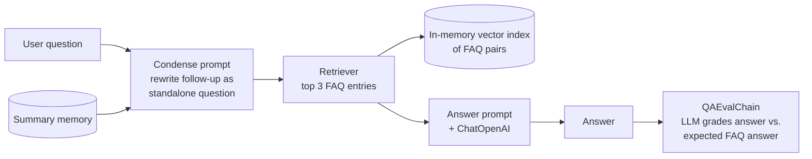

# Project 1 — FAQ Assistant

A customer-support chatbot that answers questions from a company FAQ knowledge base. It keeps track of the conversation so follow-up questions make sense, says "I'm not sure, please contact customer support" instead of guessing, and **grades every answer it gives** using an LLM as a judge.

**Course:** [LangChain for LLM Application Development](https://www.deeplearning.ai/short-courses/langchain-for-llm-application-development/) (DeepLearning.AI)
**Stack:** Python · LangChain · OpenAI (`gpt-3.5-turbo`, OpenAI embeddings) · DocArray in-memory vector search

## How it works



1. **Load the knowledge base:** `fake.json` holds 25 FAQ question/answer pairs. Each pair is turned into one document (`Q: … A: …`).
2. **Index:** documents are embedded with OpenAI embeddings and stored in an in-memory vector index.
3. **Remember the conversation:** `ConversationSummaryBufferMemory` keeps a running summary of the chat (up to 1,000 tokens), so long conversations don't overflow the model.
4. **Rewrite follow-ups:** a "condense" prompt turns questions like "and how long does it take?" into a standalone question before searching.
5. **Answer:** a `ConversationalRetrievalChain` retrieves the 3 most relevant FAQ entries and answers using only that context. The prompt tells it to reply *"I'm not sure, please contact customer support."* when the answer isn't there.
6. **Evaluate:** after each answer, `QAEvalChain` asks the LLM whether the bot's answer matches the answer stored in the FAQ, and prints `CORRECT` or `INCORRECT`. Off-topic questions that were correctly refused are marked correct.

## Files

| File | Purpose |
|------|---------|
| `app.py` | The chatbot: indexing, memory, retrieval chain, evaluation and the chat loop |
| `fake.json` | The FAQ knowledge base (25 Q&A pairs) used by `app.py` |
| `train_expanded.json` | An expanded set of 200 FAQ pairs (JSON Lines format). Not loaded by `app.py` by default |
| `requirements.txt` | Python dependencies |

## Run it

```bash
pip install -r requirements.txt
# create a .env file next to app.py containing: OPENAI_API_KEY=your-key
python app.py
```

Type a question, or `exit` to quit.

**Example**
```
You: How long does shipping take?
Bot: Standard shipping takes 3–5 business days, express takes 1–2 days.
Eval: CORRECT
```

## What I learned

- Prompt templates, chains and output parsing in LangChain
- Different memory types and why a summary buffer suits long chats
- Retrieval over a small knowledge base
- Using an LLM to evaluate another LLM's answers, and its limits (the judge can be wrong too)
