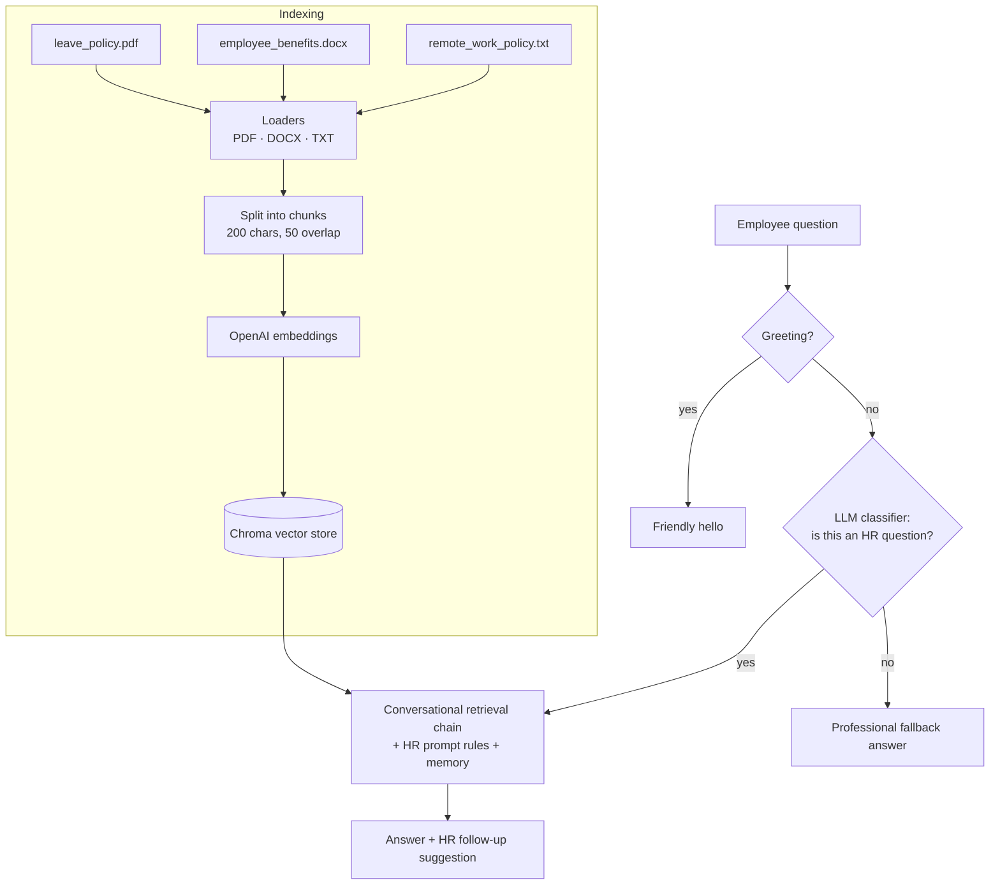

# Project 2 — HR Policy RAG Chatbot ("HR AssistantGPT")

An internal HR assistant that answers employee questions using the company's own policy documents. It reads PDFs, Word files and text files, finds the passages that answer the question, and replies like a professional HR colleague. It never invents policies or numbers, and questions that aren't about HR get a short, polite fallback instead of a made-up answer.

**Course:** [LangChain: Chat with Your Data](https://www.deeplearning.ai/short-courses/langchain-chat-with-your-data/) (DeepLearning.AI)
**Stack:** Python · LangChain · OpenAI (`gpt-3.5-turbo`, OpenAI embeddings) · Chroma vector database

## How it works



1. **Load documents** with the right loader for each format (`PyPDFLoader`, `Docx2txtLoader`, `TextLoader`).
2. **Split** them into small overlapping chunks so retrieval is precise.
3. **Embed and store** the chunks in a Chroma vector database.
4. **Route the question:** an LLM classifier decides whether the question is about HR policies, benefits, leave or workplace rules.
5. **Answer HR questions** with a `ConversationalRetrievalChain`. Its prompt sets eight rules, including: answer only from the documents, never invent policies or numbers, use the employee's name if given, avoid repeating earlier answers, and end with a professional HR next step.
6. **Handle everything else** with a short, professional fallback, and greet users without wasting a retrieval call.

## Files

| File | Purpose |
|------|---------|
| `rag.py` | The full pipeline: loading, splitting, vector store, HR classifier, retrieval chain and chat loop |
| `leave_policy.pdf` | Sample leave policy (synthetic) |
| `employee_benefits.docx` | Sample employee benefits overview (synthetic) |
| `remote_work_policy.txt` | Sample remote work policy (synthetic) |
| `requirements.txt` | Python dependencies |

The policy documents are synthetic sample data written for this project, not a real company's policies.

## Run it

```bash
pip install -r requirements.txt
export OPENAI_API_KEY=your-key        # Windows: set OPENAI_API_KEY=your-key
python rag.py
```

Run it from inside this folder so the three policy files are found. Type `exit` to quit.

**Example questions**
- "Who is eligible for remote work?"
- "What types of retirement plans are there?"
- "Can I take unpaid leave?"
- "What's the weather today?" → polite non-HR fallback

## What I learned

- Loading and splitting documents of different formats
- Embeddings and vector databases for semantic search
- Building a full RAG pipeline with conversation memory
- Writing prompt rules that keep a chatbot grounded and on-topic
- Routing questions with a lightweight LLM classifier before running the expensive chain
