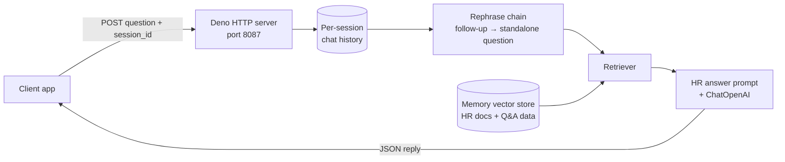

# Project 3 — HR Chatbot REST API (LangChain.js)

The HR assistant from [Project 2](../02-HR-Policy-RAG-Chatbot), rebuilt in **TypeScript with LangChain.js** and served as a **REST API**. Any web or mobile app can send a question over HTTP and get an answer grounded in the company's HR documents. Each user gets their own chat history, keyed by `session_id`, so follow-up questions work across requests.

**Course:** [Build LLM Apps with LangChain.js](https://www.deeplearning.ai/short-courses/build-llm-apps-with-langchain-js/) (DeepLearning.AI)
**Stack:** TypeScript · LangChain.js · Deno · OpenAI (`gpt-3.5-turbo-1106`, OpenAI embeddings) · in-memory vector store

## How it works



1. **Load data** from `./data`: PDFs, text files and JSON. JSON Q&A pairs become `Q: … A: …` documents.
2. **Split** into 1,536-character chunks with 128-character overlap, then **embed** and store them in a `MemoryVectorStore`.
3. **Rephrase** each question into a standalone question using the session's chat history.
4. **Retrieve** the relevant chunks and **answer** with the same HR rules as Project 2: grounded answers only, no invented policies or numbers, professional follow-up suggestions.
5. **Remember** each conversation with `RunnableWithMessageHistory`, keyed by `session_id`.
6. **Serve** it with `Deno.serve()` on port 8087. A `POST` returns `{ "reply": ... }`; a `GET` confirms the server is running.

## Files

| File | Purpose |
|------|---------|
| `main.ipynb` | Deno notebook that builds the chain, starts the server and sends a test request |
| `lib/helpers.ts` | Reusable pieces: document loading, splitting, vector store, rephrase chain, retrieval chain, HR prompt, fallback chain |
| `deno.json` | Pinned LangChain.js package versions |
| `data/data.json` | 15 HR question/answer pairs (synthetic) |
| `data/leave_policy.pdf`, `data/remote_work_policy.txt` | Sample HR policies (synthetic, shared with Project 2) |

## Run it

Requirements: [Deno](https://deno.com/) and Jupyter with the Deno kernel (`deno jupyter --install`).

```bash
# from this folder
echo "OPENAI_API_KEY=your-key" > .env
jupyter notebook main.ipynb
```

Run the notebook cell. It starts the API on `http://localhost:8087` and sends a sample question.

**Call the API**
```bash
curl -X POST http://localhost:8087 \
  -H "content-type: application/json" \
  -d '{"question": "Who is eligible for remote work?", "session_id": "1"}'
```

## What I learned

- The same RAG concepts carry over from Python to JavaScript/TypeScript
- Composing chains with LCEL (`RunnableSequence`, `RunnablePassthrough`)
- Keeping separate conversation memory per user session
- Exposing an LLM pipeline as an HTTP endpoint that other apps can use
